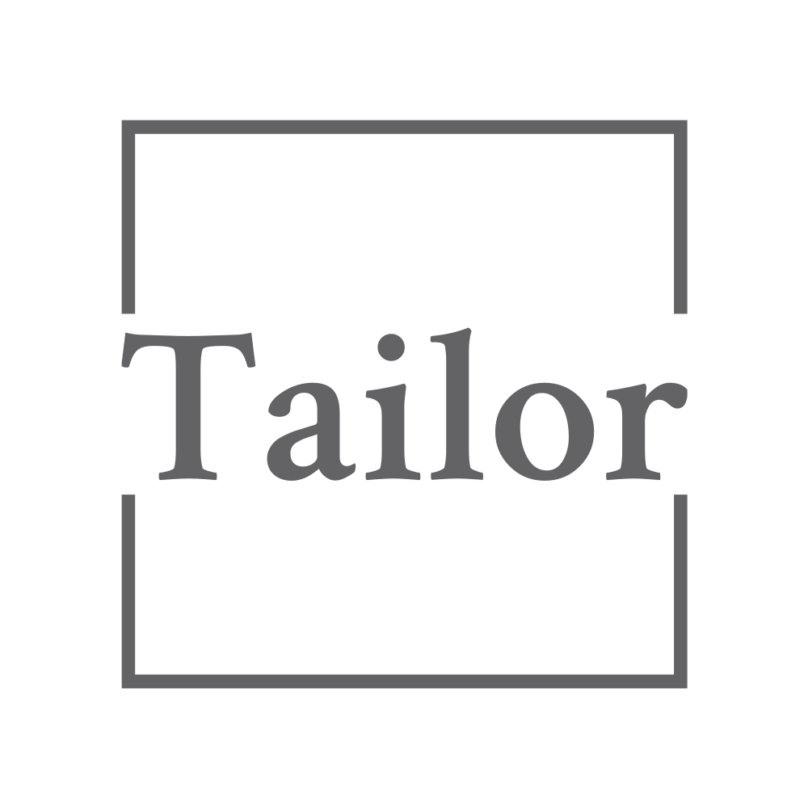
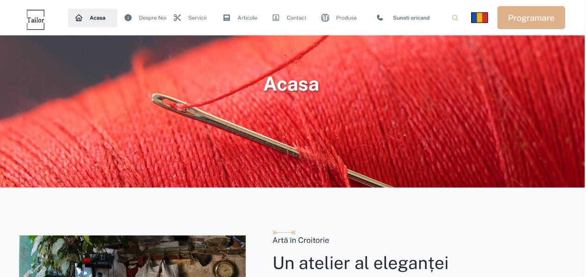
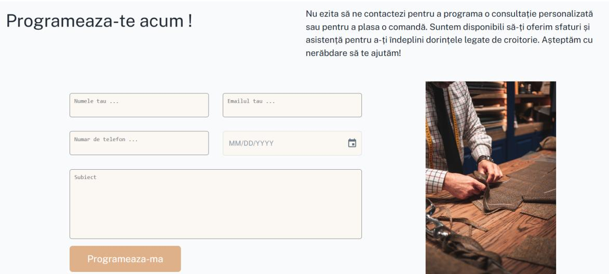
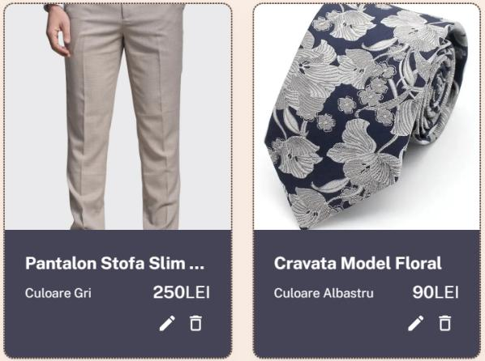
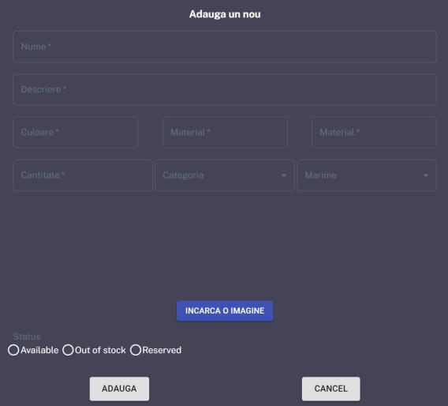
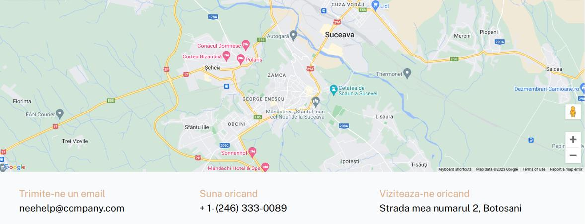

<!-- README HEADER -->
 

    
    <h3 align="center">Tailor Web Application</h3>

<!-- TABLE OF CONTENTS -->

  
Table of Contents

  <ol>
    <li>
      <a href="#about-the-project">About The Project</a>
      <ul>
        <li><a href="#built-with">Built With</a></li>
      </ul>
    </li>
    <li><a href="#contact">Contact</a></li>
    <li><a href="#acknowledgments">Acknowledgments</a></li>
  </ol>

<!-- ABOUT THE PROJECT -->

## About The Project

        

The application has as it's main purpose to:

- automatize the client's ability to book an appointment

        

- transfer information and responsability between employees that work on the same product
- present to customers a product catalog packed with all the information needed about each product that is easily managed from the employee dashboard

        
        

- offer a way to create an online presence for the company

        

(<a href="#readme-top">back to top</a>)

### Built With

<!-- - [![Next][Next.js]][Next-url]
- [![React][React.js]][React-url] -->
<ol>

<ul> Back End </ul>
<ul>
<ul> ASP.NET Core C# </ul>
<ul> .NET 6.0 </ul>
<ul> SQL </ul>
</ul>

<ul> Front End </ul>
<ul>
<ul> REACT </ul>
<ul> JavaScript </ul>
<ul>
</ol>

(<a href="#readme-top">back to top</a>)

<!-- ROADMAP -->

## Roadmap

- [x] Presentation pages for the company.
- [x] In-page information management system for employees.
- [x] Appointment monitoring system.
- [ ] To implement the order management system on the front-end as well.
- [ ] Improving the user experience for employees logged into the app.
- [ ] Improving visitor interaction with employees.

(<a href="#readme-top">back to top</a>)

<!-- CONTACT -->

## Contact

Miron Andrei - [LinkedIn](www.linkedin.com/in/andrei-miron-a51236245) - andreimiron001@gmail.com

Project Link: [https://github.com/AndreiMiron-hub/Tailor-Web-Application](https://github.com/AndreiMiron-hub/Tailor-Web-Application)

(<a href="#readme-top">back to top</a>)

<!-- ACKNOWLEDGMENTS -->

## Acknowledgments

- [Material Icons](https://mui.com/material-ui/material-icons/)
- [LOGO](https://logo.com/)
- [AutoMapper](https://docs.automapper.org/en/stable/)
- [FluentValidation](https://docs.fluentvalidation.net/en/latest/index.html)
- [EntityFramework](https://learn.microsoft.com/en-us/ef/core/)
- [React](https://react.dev/learn)
- [Redux](https://redux.js.org/introduction/getting-started)

(<a href="#readme-top">back to top</a>)

<!-- MARKDOWN LINKS & IMAGES -->
<!--
[React.js]: https://img.shields.io/badge/React-20232A?style=for-the-badge&logo=react&logoColor=61DAFB -->

[product-screenshot]: images/HomePage.png
[contactForm-screenshot]: images/ContactForm.png
[contactWays-screenshot]: images/ContactMethods.png
[prodCatalog-screenshot]: images/ProdCatalog.png
[prodForm-screenshot]: images/ProdForm.png
